# Disperse Transfer Functions

Standalone functions for bulk sending SOL and SPL tokens on Solana. These functions are self-contained and can be used without importing the full soltoolkit-sdk library.

## Features

- ✅ **Bulk SOL transfers** - Send SOL to multiple recipients
- ✅ **Bulk SPL token transfers** - Send any SPL token to multiple recipients
- ✅ **Automatic transaction batching** - Optimally batches instructions into transactions
- ✅ **Token account creation** - Automatically creates associated token accounts if needed
- ✅ **Zero external dependencies** (except @solana/web3.js and @solana/spl-token)

## Installation

Copy the entire `bulk` directory to your project. You only need these dependencies:

```bash
npm install @solana/web3.js @solana/spl-token
```

## Quick Start

### Bulk SOL Transfer

```typescript
import { Connection, Keypair, PublicKey } from '@solana/web3.js';
import { generateBulkSolTransactions } from './bulk';

const connection = new Connection('https://api.devnet.solana.com');
const sender = Keypair.generate(); // Your keypair

// Generate transactions
const transactions = generateBulkSolTransactions({
  sender: sender.publicKey,
  recipients: [
    'recipient1PublicKey',
    'recipient2PublicKey',
    'recipient3PublicKey',
  ],
  fixedAmount: 1_000_000, // 0.001 SOL in lamports
  instructionsPerTx: 18, // Optional, default is 18
  memo: 'Bulk transfer', // Optional
});

// Sign and send transactions
for (const tx of transactions) {
  const { blockhash } = await connection.getLatestBlockhash();
  tx.recentBlockhash = blockhash;
  tx.feePayer = sender.publicKey;
  tx.sign(sender);

  const signature = await connection.sendRawTransaction(tx.serialize());
  await connection.confirmTransaction(signature);
  console.log('Transaction:', signature);
}
```

### Bulk SPL Token Transfer

```typescript
import { Connection, Keypair, PublicKey } from '@solana/web3.js';
import { generateCompleteBulkSplTransactions } from './bulk';

const connection = new Connection('https://api.devnet.solana.com');
const sender = Keypair.generate(); // Your keypair
const mint = new PublicKey('YourTokenMintAddress');

// Generate all necessary transactions
const { accountCreationTxs, transferTxs } = await generateCompleteBulkSplTransactions(
  connection,
  {
    sender: sender.publicKey,
    mint: mint,
    recipients: [
      'recipient1PublicKey',
      'recipient2PublicKey',
      'recipient3PublicKey',
    ],
    fixedAmount: 1_000_000, // Raw token amount (not decimal adjusted)
    instructionsPerTx: 18, // Optional
    memo: 'Bulk SPL transfer', // Optional
  }
);

// 1. First, create token accounts (if needed)
for (const tx of accountCreationTxs) {
  const { blockhash } = await connection.getLatestBlockhash();
  tx.recentBlockhash = blockhash;
  tx.feePayer = sender.publicKey;
  tx.sign(sender);

  const signature = await connection.sendRawTransaction(tx.serialize());
  await connection.confirmTransaction(signature);
  console.log('Account creation tx:', signature);
}

// 2. Then, send the tokens
for (const tx of transferTxs) {
  const { blockhash } = await connection.getLatestBlockhash();
  tx.recentBlockhash = blockhash;
  tx.feePayer = sender.publicKey;
  tx.sign(sender);

  const signature = await connection.sendRawTransaction(tx.serialize());
  await connection.confirmTransaction(signature);
  console.log('Transfer tx:', signature);
}
```

## API Reference

### SOL Transfers

#### `generateBulkSolTransactions(config: IBulkSolTransferConfig): Transaction[]`

Generates transactions for bulk SOL transfers.

**Config Options:**
- `sender: PublicKey` - The sender's public key
- `transfers?: ITransfer[]` - Array of { recipient, amount } for variable amounts
- `recipients?: string[]` - Array of recipient addresses (use with fixedAmount)
- `fixedAmount?: number` - Fixed amount in lamports to send to each recipient
- `instructionsPerTx?: number` - Instructions per transaction (default: 18)
- `memo?: string` - Optional memo text

**Returns:** Array of unsigned transactions

### SPL Token Transfers

#### `generateBulkSplTransactions(config: IBulkSplTransferConfig): Transaction[]`

Generates transactions for bulk SPL token transfers. **Note:** Assumes token accounts exist.

**Config Options:**
- `sender: PublicKey` - The sender's public key
- `mint: PublicKey` - The token mint address
- `transfers?: ITransfer[]` - Array of { recipient, amount } for variable amounts
- `recipients?: string[]` - Array of recipient addresses (use with fixedAmount)
- `fixedAmount?: number` - Fixed raw token amount to send to each recipient
- `instructionsPerTx?: number` - Instructions per transaction (default: 18)
- `memo?: string` - Optional memo text

**Returns:** Array of unsigned transactions

#### `generateTokenAccountCreationTransactions(connection, mint, payer, recipients, instructionsPerTx?): Promise<Transaction[]>`

Generates transactions to create associated token accounts for recipients who don't have them yet.

**Parameters:**
- `connection: Connection` - Solana connection
- `mint: PublicKey` - Token mint address
- `payer: PublicKey` - Account that pays for creation
- `recipients: string[]` - Array of recipient addresses
- `instructionsPerTx?: number` - Instructions per transaction (default: 12)

**Returns:** Array of unsigned transactions

#### `generateCompleteBulkSplTransactions(connection, config): Promise<{accountCreationTxs, transferTxs}>`

Complete workflow that generates both account creation and transfer transactions.

**Returns:** Object with `accountCreationTxs` and `transferTxs` arrays

## Detailed Usage Examples

### Example 1: Basic SOL Transfer with Error Handling

```typescript
import { Connection, Keypair, PublicKey, LAMPORTS_PER_SOL } from '@solana/web3.js';
import { generateBulkSolTransactions } from './bulk';

async function sendBulkSol() {
  const connection = new Connection('https://api.devnet.solana.com');
  const sender = Keypair.generate(); // Load your keypair

  // Send 0.1 SOL to each recipient
  const transactions = generateBulkSolTransactions({
    sender: sender.publicKey,
    recipients: [
      'HN7cABqLq46Es1jh92dQQisAq662SmxELLLsHHe4YWrH',
      '8gC3pyoD8QXRhVFsGZg5bXd7kFZ7YqWPvCFkqVPDhQCj',
      'CuieVDEDtLo7FypA9SbLM9saXFdb1dsshEkyErMqkRQq',
    ],
    fixedAmount: 0.1 * LAMPORTS_PER_SOL,
    memo: 'Airdrop payment',
  });

  console.log(`Created ${transactions.length} transactions`);

  // Sign and send each transaction
  for (let i = 0; i < transactions.length; i++) {
    const tx = transactions[i];

    try {
      const { blockhash, lastValidBlockHeight } = await connection.getLatestBlockhash();
      tx.recentBlockhash = blockhash;
      tx.feePayer = sender.publicKey;
      tx.sign(sender);

      const signature = await connection.sendRawTransaction(tx.serialize());
      console.log(`Transaction ${i + 1}/${transactions.length}: ${signature}`);

      // Wait for confirmation
      await connection.confirmTransaction({
        signature,
        blockhash,
        lastValidBlockHeight,
      });

      console.log(`✅ Confirmed: ${signature}`);
    } catch (error) {
      console.error(`❌ Transaction ${i + 1} failed:`, error);
      // Continue with next transaction even if one fails
    }
  }
}
```

### Example 2: Variable SOL Amounts

```typescript
import { Connection, Keypair, LAMPORTS_PER_SOL } from '@solana/web3.js';
import { generateBulkSolTransactions } from './bulk';

// Different amounts for each recipient (e.g., reward distribution)
const transactions = generateBulkSolTransactions({
  sender: sender.publicKey,
  transfers: [
    { recipient: 'HN7cABqLq46Es1jh92dQQisAq662SmxELLLsHHe4YWrH', amount: 1 * LAMPORTS_PER_SOL },      // 1 SOL
    { recipient: '8gC3pyoD8QXRhVFsGZg5bXd7kFZ7YqWPvCFkqVPDhQCj', amount: 0.5 * LAMPORTS_PER_SOL },    // 0.5 SOL
    { recipient: 'CuieVDEDtLo7FypA9SbLM9saXFdb1dsshEkyErMqkRQq', amount: 0.25 * LAMPORTS_PER_SOL },   // 0.25 SOL
  ],
  memo: 'Competition rewards',
});
```

### Example 3: SPL Token Transfer with Decimal Conversion

```typescript
import { Connection, Keypair, PublicKey } from '@solana/web3.js';
import { getMint } from '@solana/spl-token';
import { generateCompleteBulkSplTransactions } from './bulk';

async function sendBulkTokens() {
  const connection = new Connection('https://api.devnet.solana.com');
  const sender = Keypair.generate(); // Load your keypair
  const mintAddress = new PublicKey('EPjFWdd5AufqSSqeM2qN1xzybapC8G4wEGGkZwyTDt1v'); // USDC mint

  // Get token decimals to convert human-readable amounts
  const mintInfo = await getMint(connection, mintAddress);
  const decimals = mintInfo.decimals;
  console.log(`Token has ${decimals} decimals`);

  // Send 100 tokens to each recipient
  const humanAmount = 100;
  const rawAmount = humanAmount * Math.pow(10, decimals);

  const { accountCreationTxs, transferTxs } = await generateCompleteBulkSplTransactions(
    connection,
    {
      sender: sender.publicKey,
      mint: mintAddress,
      recipients: [
        'HN7cABqLq46Es1jh92dQQisAq662SmxELLLsHHe4YWrH',
        '8gC3pyoD8QXRhVFsGZg5bXd7kFZ7YqWPvCFkqVPDhQCj',
        'CuieVDEDtLo7FypA9SbLM9saXFdb1dsshEkyErMqkRQq',
      ],
      fixedAmount: rawAmount,
      memo: 'USDC distribution',
    }
  );

  console.log(`Account creation txs: ${accountCreationTxs.length}`);
  console.log(`Transfer txs: ${transferTxs.length}`);

  // Phase 1: Create token accounts
  for (let i = 0; i < accountCreationTxs.length; i++) {
    const tx = accountCreationTxs[i];
    const { blockhash, lastValidBlockHeight } = await connection.getLatestBlockhash();
    tx.recentBlockhash = blockhash;
    tx.feePayer = sender.publicKey;
    tx.sign(sender);

    const signature = await connection.sendRawTransaction(tx.serialize());
    await connection.confirmTransaction({ signature, blockhash, lastValidBlockHeight });
    console.log(`✅ Account creation ${i + 1}/${accountCreationTxs.length}: ${signature}`);
  }

  // Phase 2: Transfer tokens
  for (let i = 0; i < transferTxs.length; i++) {
    const tx = transferTxs[i];
    const { blockhash, lastValidBlockHeight } = await connection.getLatestBlockhash();
    tx.recentBlockhash = blockhash;
    tx.feePayer = sender.publicKey;
    tx.sign(sender);

    const signature = await connection.sendRawTransaction(tx.serialize());
    await connection.confirmTransaction({ signature, blockhash, lastValidBlockHeight });
    console.log(`✅ Transfer ${i + 1}/${transferTxs.length}: ${signature}`);
  }
}
```

### Example 4: SPL Token with Variable Amounts

```typescript
import { Connection, Keypair, PublicKey } from '@solana/web3.js';
import { getMint } from '@solana/spl-token';
import { generateCompleteBulkSplTransactions } from './bulk';

async function sendVariableTokenAmounts() {
  const connection = new Connection('https://api.devnet.solana.com');
  const sender = Keypair.generate();
  const mintAddress = new PublicKey('So11111111111111111111111111111111111111112'); // Wrapped SOL

  const mintInfo = await getMint(connection, mintAddress);
  const decimals = mintInfo.decimals;

  // Convert human-readable amounts to raw amounts
  const toRawAmount = (amount: number) => amount * Math.pow(10, decimals);

  const { accountCreationTxs, transferTxs } = await generateCompleteBulkSplTransactions(
    connection,
    {
      sender: sender.publicKey,
      mint: mintAddress,
      transfers: [
        { recipient: 'HN7cABqLq46Es1jh92dQQisAq662SmxELLLsHHe4YWrH', amount: toRawAmount(10) },
        { recipient: '8gC3pyoD8QXRhVFsGZg5bXd7kFZ7YqWPvCFkqVPDhQCj', amount: toRawAmount(20) },
        { recipient: 'CuieVDEDtLo7FypA9SbLM9saXFdb1dsshEkyErMqkRQq', amount: toRawAmount(15) },
      ],
      memo: 'Payroll distribution',
    }
  );

  // Send transactions (same pattern as Example 3)
}
```

### Example 5: Large-Scale Airdrop (1000+ Recipients)

```typescript
import { Connection, Keypair, LAMPORTS_PER_SOL } from '@solana/web3.js';
import { generateBulkSolTransactions } from './bulk';

async function largeScaleAirdrop() {
  const connection = new Connection('https://api.mainnet-beta.solana.com');
  const sender = Keypair.generate();

  // Load 1000 recipient addresses from a file or database
  const recipients = [
    // ... 1000 addresses
  ];

  const transactions = generateBulkSolTransactions({
    sender: sender.publicKey,
    recipients,
    fixedAmount: 0.01 * LAMPORTS_PER_SOL, // 0.01 SOL each
    instructionsPerTx: 18,
    memo: 'NFT holder airdrop',
  });

  console.log(`Sending to ${recipients.length} recipients`);
  console.log(`Total transactions: ${transactions.length}`);
  console.log(`Estimated fee: ${transactions.length * 0.000005} SOL`);
  console.log(`Total cost: ${(recipients.length * 0.01) + (transactions.length * 0.000005)} SOL`);

  let successCount = 0;
  let failCount = 0;

  for (let i = 0; i < transactions.length; i++) {
    const tx = transactions[i];

    try {
      const { blockhash, lastValidBlockHeight } = await connection.getLatestBlockhash();
      tx.recentBlockhash = blockhash;
      tx.feePayer = sender.publicKey;
      tx.sign(sender);

      const signature = await connection.sendRawTransaction(tx.serialize(), {
        skipPreflight: false,
        maxRetries: 3,
      });

      await connection.confirmTransaction({
        signature,
        blockhash,
        lastValidBlockHeight,
      });

      successCount++;
      console.log(`[${i + 1}/${transactions.length}] ✅ Success: ${signature}`);

      // Rate limiting to avoid overwhelming the RPC
      await new Promise(resolve => setTimeout(resolve, 500));

    } catch (error) {
      failCount++;
      console.error(`[${i + 1}/${transactions.length}] ❌ Failed:`, error.message);
    }
  }

  console.log(`\nResults: ${successCount} succeeded, ${failCount} failed`);
}
```

### Example 6: Custom Batch Size Configuration

```typescript
import { generateBulkSolTransactions } from './bulk';

// Smaller batch size for better reliability (more transactions, lower failure risk)
const conservativeTxs = generateBulkSolTransactions({
  sender: sender.publicKey,
  recipients: recipients,
  fixedAmount: 1_000_000,
  instructionsPerTx: 10, // Smaller batches = more headroom
  memo: 'Conservative batch',
});

// Larger batch size for cost efficiency (fewer transactions, higher compute)
const aggressiveTxs = generateBulkSolTransactions({
  sender: sender.publicKey,
  recipients: recipients,
  fixedAmount: 1_000_000,
  instructionsPerTx: 18, // Maximum recommended
  memo: 'Aggressive batch',
});

console.log(`Conservative: ${conservativeTxs.length} txs`);
console.log(`Aggressive: ${aggressiveTxs.length} txs`);
```

### Example 7: Checking Token Account Existence Before Transfer

```typescript
import { Connection, PublicKey } from '@solana/web3.js';
import { getAssociatedTokenAddress } from '@solana/spl-token';
import { generateTokenAccountCreationTransactions, generateBulkSplTransactions } from './bulk';

async function checkAndCreateAccounts() {
  const connection = new Connection('https://api.devnet.solana.com');
  const mint = new PublicKey('YourMintAddress');
  const recipients = ['address1', 'address2', 'address3'];

  // Manually check which accounts exist
  const accountChecks = await Promise.all(
    recipients.map(async (recipient) => {
      const recipientPubkey = new PublicKey(recipient);
      const ata = await getAssociatedTokenAddress(mint, recipientPubkey);
      const accountInfo = await connection.getAccountInfo(ata);
      return {
        recipient,
        exists: accountInfo !== null,
        ata: ata.toString(),
      };
    })
  );

  const existingAccounts = accountChecks.filter(a => a.exists);
  const missingAccounts = accountChecks.filter(a => !a.exists);

  console.log(`Existing accounts: ${existingAccounts.length}`);
  console.log(`Missing accounts: ${missingAccounts.length}`);

  // Only create accounts that are missing
  if (missingAccounts.length > 0) {
    const creationTxs = await generateTokenAccountCreationTransactions(
      connection,
      mint,
      sender.publicKey,
      missingAccounts.map(a => a.recipient),
      12
    );
    console.log(`Will create ${missingAccounts.length} accounts in ${creationTxs.length} txs`);
  }
}
```

## Real-World Use Cases

### Use Case 1: NFT Holder Airdrop

```typescript
import { Connection, Keypair, LAMPORTS_PER_SOL } from '@solana/web3.js';
import { generateBulkSolTransactions } from './bulk';

async function nftHolderAirdrop() {
  const connection = new Connection('https://api.mainnet-beta.solana.com');
  const sender = Keypair.generate(); // Your treasury wallet

  // Get NFT holders from your collection (using a service like Helius, SimpleHash, etc.)
  const nftHolders = [
    'Holder1Address...',
    'Holder2Address...',
    // ... more holders
  ];

  // Airdrop 0.05 SOL to each NFT holder
  const transactions = generateBulkSolTransactions({
    sender: sender.publicKey,
    recipients: nftHolders,
    fixedAmount: 0.05 * LAMPORTS_PER_SOL,
    instructionsPerTx: 18,
    memo: 'Thank you for holding our NFT! 🎁',
  });

  console.log(`Airdropping to ${nftHolders.length} holders`);
  console.log(`Total amount: ${nftHolders.length * 0.05} SOL`);
  console.log(`Transaction fee: ~${transactions.length * 0.000005} SOL`);

  // Execute transactions with progress tracking
  for (let i = 0; i < transactions.length; i++) {
    const tx = transactions[i];
    const { blockhash, lastValidBlockHeight } = await connection.getLatestBlockhash();
    tx.recentBlockhash = blockhash;
    tx.feePayer = sender.publicKey;
    tx.sign(sender);

    const signature = await connection.sendRawTransaction(tx.serialize());
    await connection.confirmTransaction({ signature, blockhash, lastValidBlockHeight });

    console.log(`Progress: ${((i + 1) / transactions.length * 100).toFixed(1)}% | Tx: ${signature}`);
  }
}
```

### Use Case 2: Monthly Payroll Distribution

```typescript
import { Connection, Keypair, PublicKey } from '@solana/web3.js';
import { getMint } from '@solana/spl-token';
import { generateCompleteBulkSplTransactions } from './bulk';

async function monthlyPayroll() {
  const connection = new Connection('https://api.mainnet-beta.solana.com');
  const treasury = Keypair.generate();
  const usdcMint = new PublicKey('EPjFWdd5AufqSSqeM2qN1xzybapC8G4wEGGkZwyTDt1v');

  // Get USDC decimals (6 for USDC)
  const mintInfo = await getMint(connection, usdcMint);
  const decimals = mintInfo.decimals;

  // Employee payroll data
  const payroll = [
    { employee: 'Employee1Address...', monthlySalary: 5000 },   // $5,000
    { employee: 'Employee2Address...', monthlySalary: 7500 },   // $7,500
    { employee: 'Employee3Address...', monthlySalary: 10000 },  // $10,000
  ];

  const transfers = payroll.map(p => ({
    recipient: p.employee,
    amount: p.monthlySalary * Math.pow(10, decimals), // Convert to raw amount
  }));

  const { accountCreationTxs, transferTxs } = await generateCompleteBulkSplTransactions(
    connection,
    {
      sender: treasury.publicKey,
      mint: usdcMint,
      transfers,
      memo: `Payroll - ${new Date().toISOString().slice(0, 7)}`, // e.g., "Payroll - 2024-03"
    }
  );

  // Create accounts if needed
  for (const tx of accountCreationTxs) {
    const { blockhash, lastValidBlockHeight } = await connection.getLatestBlockhash();
    tx.recentBlockhash = blockhash;
    tx.feePayer = treasury.publicKey;
    tx.sign(treasury);
    const sig = await connection.sendRawTransaction(tx.serialize());
    await connection.confirmTransaction({ signature: sig, blockhash, lastValidBlockHeight });
  }

  // Send payroll
  for (const tx of transferTxs) {
    const { blockhash, lastValidBlockHeight } = await connection.getLatestBlockhash();
    tx.recentBlockhash = blockhash;
    tx.feePayer = treasury.publicKey;
    tx.sign(treasury);
    const sig = await connection.sendRawTransaction(tx.serialize());
    await connection.confirmTransaction({ signature: sig, blockhash, lastValidBlockHeight });
  }

  const totalPayout = payroll.reduce((sum, p) => sum + p.monthlySalary, 0);
  console.log(`✅ Payroll complete! Total: $${totalPayout.toLocaleString()}`);
}
```

### Use Case 3: Refund Distribution

```typescript
import { Connection, Keypair, LAMPORTS_PER_SOL } from '@solana/web3.js';
import { generateBulkSolTransactions } from './bulk';

async function refundDistribution() {
  const connection = new Connection('https://api.mainnet-beta.solana.com');
  const refundWallet = Keypair.generate();

  // Users who purchased tickets for a cancelled event
  const refundData = [
    { user: 'User1Address...', ticketsPurchased: 2, pricePerTicket: 0.5 },
    { user: 'User2Address...', ticketsPurchased: 1, pricePerTicket: 0.5 },
    { user: 'User3Address...', ticketsPurchased: 4, pricePerTicket: 0.5 },
  ];

  const transfers = refundData.map(r => ({
    recipient: r.user,
    amount: Math.floor(r.ticketsPurchased * r.pricePerTicket * LAMPORTS_PER_SOL),
  }));

  const transactions = generateBulkSolTransactions({
    sender: refundWallet.publicKey,
    transfers,
    memo: 'Event cancellation refund',
  });

  console.log(`Refunding ${refundData.length} users`);

  for (const tx of transactions) {
    const { blockhash, lastValidBlockHeight } = await connection.getLatestBlockhash();
    tx.recentBlockhash = blockhash;
    tx.feePayer = refundWallet.publicKey;
    tx.sign(refundWallet);

    const sig = await connection.sendRawTransaction(tx.serialize());
    await connection.confirmTransaction({ signature: sig, blockhash, lastValidBlockHeight });
    console.log(`Refund sent: ${sig}`);
  }
}
```

### Use Case 4: Token Launch Airdrop to Early Supporters

```typescript
import { Connection, Keypair, PublicKey } from '@solana/web3.js';
import { getMint } from '@solana/spl-token';
import { generateCompleteBulkSplTransactions } from './bulk';

async function tokenLaunchAirdrop() {
  const connection = new Connection('https://api.mainnet-beta.solana.com');
  const projectTreasury = Keypair.generate();
  const projectTokenMint = new PublicKey('YourNewTokenMintAddress');

  const mintInfo = await getMint(connection, projectTokenMint);
  const decimals = mintInfo.decimals;

  // Tiered airdrop for different supporter levels
  const airdropTiers = {
    earlyBacker: { amount: 10000, recipients: [] },      // 10,000 tokens
    contributor: { amount: 5000, recipients: [] },       // 5,000 tokens
    community: { amount: 1000, recipients: [] },         // 1,000 tokens
  };

  // Combine all tiers into transfers array
  const transfers = [
    ...airdropTiers.earlyBacker.recipients.map(r => ({
      recipient: r,
      amount: airdropTiers.earlyBacker.amount * Math.pow(10, decimals),
    })),
    ...airdropTiers.contributor.recipients.map(r => ({
      recipient: r,
      amount: airdropTiers.contributor.amount * Math.pow(10, decimals),
    })),
    ...airdropTiers.community.recipients.map(r => ({
      recipient: r,
      amount: airdropTiers.community.amount * Math.pow(10, decimals),
    })),
  ];

  const { accountCreationTxs, transferTxs } = await generateCompleteBulkSplTransactions(
    connection,
    {
      sender: projectTreasury.publicKey,
      mint: projectTokenMint,
      transfers,
      memo: 'Thank you for your early support! 🚀',
    }
  );

  console.log(`Airdropping to ${transfers.length} supporters`);
  console.log(`Account creation txs: ${accountCreationTxs.length}`);
  console.log(`Transfer txs: ${transferTxs.length}`);

  // Execute account creation
  for (const tx of accountCreationTxs) {
    const { blockhash, lastValidBlockHeight } = await connection.getLatestBlockhash();
    tx.recentBlockhash = blockhash;
    tx.feePayer = projectTreasury.publicKey;
    tx.sign(projectTreasury);
    const sig = await connection.sendRawTransaction(tx.serialize());
    await connection.confirmTransaction({ signature: sig, blockhash, lastValidBlockHeight });
  }

  // Execute transfers
  for (const tx of transferTxs) {
    const { blockhash, lastValidBlockHeight } = await connection.getLatestBlockhash();
    tx.recentBlockhash = blockhash;
    tx.feePayer = projectTreasury.publicKey;
    tx.sign(projectTreasury);
    const sig = await connection.sendRawTransaction(tx.serialize());
    await connection.confirmTransaction({ signature: sig, blockhash, lastValidBlockHeight });
  }
}
```

### Use Case 5: Competition Prize Distribution

```typescript
import { Connection, Keypair, LAMPORTS_PER_SOL } from '@solana/web3.js';
import { generateBulkSolTransactions } from './bulk';

async function competitionPrizes() {
  const connection = new Connection('https://api.mainnet-beta.solana.com');
  const prizePool = Keypair.generate();

  // Competition winners with different prize amounts
  const winners = [
    { rank: 1, wallet: 'FirstPlaceAddress...', prize: 10 },    // 10 SOL
    { rank: 2, wallet: 'SecondPlaceAddress...', prize: 5 },    // 5 SOL
    { rank: 3, wallet: 'ThirdPlaceAddress...', prize: 2.5 },   // 2.5 SOL
    // ... more winners
  ];

  const transfers = winners.map(w => ({
    recipient: w.wallet,
    amount: Math.floor(w.prize * LAMPORTS_PER_SOL),
  }));

  const transactions = generateBulkSolTransactions({
    sender: prizePool.publicKey,
    transfers,
    memo: 'Competition prizes - Congratulations! 🏆',
  });

  let distributed = 0;

  for (let i = 0; i < transactions.length; i++) {
    const tx = transactions[i];
    const { blockhash, lastValidBlockHeight } = await connection.getLatestBlockhash();
    tx.recentBlockhash = blockhash;
    tx.feePayer = prizePool.publicKey;
    tx.sign(prizePool);

    const sig = await connection.sendRawTransaction(tx.serialize());
    await connection.confirmTransaction({ signature: sig, blockhash, lastValidBlockHeight });

    distributed++;
    console.log(`Distributed ${distributed}/${winners.length} prizes | Tx: ${sig}`);
  }

  const totalPrizes = winners.reduce((sum, w) => sum + w.prize, 0);
  console.log(`\n✅ All prizes distributed! Total: ${totalPrizes} SOL`);
}
```

### Use Case 6: Reading Recipients from CSV File

```typescript
import { Connection, Keypair, LAMPORTS_PER_SOL } from '@solana/web3.js';
import { readFileSync } from 'fs';
import { parse } from 'csv-parse/sync';
import { generateBulkSolTransactions } from './bulk';

async function airdropFromCSV() {
  const connection = new Connection('https://api.devnet.solana.com');
  const sender = Keypair.generate();

  // Read recipients from CSV file
  // Format: wallet_address,amount
  const csvContent = readFileSync('./recipients.csv', 'utf-8');
  const records = parse(csvContent, {
    columns: true,
    skip_empty_lines: true,
  });

  const transfers = records.map(record => ({
    recipient: record.wallet_address,
    amount: parseFloat(record.amount) * LAMPORTS_PER_SOL,
  }));

  console.log(`Loaded ${transfers.length} recipients from CSV`);

  const transactions = generateBulkSolTransactions({
    sender: sender.publicKey,
    transfers,
    memo: 'CSV bulk transfer',
  });

  // Execute transactions
  for (const tx of transactions) {
    const { blockhash, lastValidBlockHeight } = await connection.getLatestBlockhash();
    tx.recentBlockhash = blockhash;
    tx.feePayer = sender.publicKey;
    tx.sign(sender);

    const sig = await connection.sendRawTransaction(tx.serialize());
    await connection.confirmTransaction({ signature: sig, blockhash, lastValidBlockHeight });
    console.log(`✅ ${sig}`);
  }
}
```

## How It Works

1. **SOL Transfers**: Batches transfer instructions into transactions (default: 18 per tx)
2. **SPL Transfers**:
   - First checks if recipient token accounts exist
   - Creates missing accounts (batched, default: 12 per tx)
   - Then batches token transfer instructions (default: 18 per tx)
3. Each transaction batch includes a memo instruction for tracking

## Architecture & Flow

### Solana Bulk Transfer Flow (This Implementation)


### SPL Token Transfer Flow


### EVM Disperse.app Smart Contract Flow

```mermaid
sequenceDiagram
    participant User as User Wallet
    participant Contract as Disperse Contract
    participant Token as ERC20 Token Contract
    participant Recipients as Recipient Wallets

    User->>User: Approve Disperse contract<br/>to spend tokens
    Note over User: Separate transaction<br/>Gas cost: ~50k gas

    User->>Contract: disperseToken(token, recipients[], amounts[])
    Note over User,Contract: Single transaction<br/>with ALL recipients

    Contract->>Contract: Validate inputs

    loop For each recipient
        Contract->>Token: transferFrom(user, recipient, amount)
        Token->>Token: Update balances
        Token->>Recipients: Transfer tokens
        Token->>Contract: Return success
    end

    Contract->>User: Return success

    Note over User,Contract: ✅ All transfers complete<br/>User paid: 1 transaction<br/>Gas: ~30k + (12k × # recipients)<br/>Smart contract required!
```



## Solana vs EVM Disperse Comparison

### Architectural Differences

| Aspect | Solana (This Implementation) | EVM (Disperse.app) |
|--------|------------------------------|-------------------|
| **Execution Model** | Client-side transaction batching | Smart contract execution |
| **Smart Contract** | ❌ Not required | ✅ Required (deployed contract) |
| **Approval Step** | ❌ Not needed | ✅ Required for tokens (separate tx) |
| **Transaction Count** | Multiple (1 per ~18 recipients) | Single transaction for all |
| **Gas/Fee Model** | Fixed: ~5000 lamports per tx | Variable: ~30k + (12k × recipients) gas |
| **Signature Model** | User signs each transaction | User signs once |
| **Atomic Execution** | ❌ Not atomic (partial success possible) | ✅ Atomic (all or nothing) |
| **Failed Transfers** | Continue to next transaction | Entire transaction reverts |
| **Compute Limits** | Per-transaction (200k-1.4M CU) | Per-block gas limit (30M gas) |
| **Trust Model** | Zero trust (direct transfers) | Must trust smart contract |
| **Supply Chain Risk** | ✅ Minimal (no contract dependency) | ⚠️ Contract code risk |
| **Flexibility** | Instructions batched client-side | Logic fixed in contract |
| **Token Account Setup** | Must pre-create for SPL tokens | Not needed for ERC20 |

### Cost Comparison Example (1000 Recipients)

#### Solana (This Implementation)
```
SOL Transfers:
- Transactions needed: ⌈1000 ÷ 18⌉ = 56 transactions
- Cost: 56 × 0.000005 SOL = 0.00028 SOL (~$0.03 at $100/SOL)

SPL Token Transfers:
- Account creation: ⌈1000 ÷ 12⌉ = 84 transactions
  - Tx fees: 84 × 0.000005 SOL = 0.00042 SOL
  - Rent: 1000 × 0.00203928 SOL = 2.03928 SOL
- Token transfers: ⌈1000 ÷ 18⌉ = 56 transactions
  - Tx fees: 56 × 0.000005 SOL = 0.00028 SOL
- Total: ~2.04 SOL (~$204 at $100/SOL)

Note: Rent is recoverable when accounts are closed
```

#### EVM (Disperse.app)
```
Token Transfers:
- Approval: ~50,000 gas
- Disperse call: 30,000 + (12,000 × 1000) = 12,030,000 gas
- Total: ~12,080,000 gas
- Cost at 50 gwei: 0.604 ETH (~$1,812 at $3,000/ETH)
- Cost at 10 gwei: 0.121 ETH (~$363 at $3,000/ETH)

Note: Highly dependent on gas prices
```

### Key Architectural Insights

#### Why Solana Uses Client-Side Batching

1. **No Smart Contract Needed**: Solana's native programs (System Program, Token Program) handle transfers directly. No custom contract deployment required.

2. **Instruction Composition**: Solana transactions are composed of multiple instructions. Each instruction can be a transfer, making batching natural.

3. **Fixed Transaction Cost**: Unlike EVM's variable gas costs, Solana has predictable fees (~5000 lamports per transaction).

4. **Parallel Processing**: Multiple transactions can be processed in parallel by Solana validators, improving throughput.

5. **No Contract Risk**: Direct use of native programs eliminates smart contract vulnerabilities and supply chain risks.

#### Why EVM Uses Smart Contracts

1. **Single Transaction Model**: EVM transactions typically call a single contract function. To batch transfers, you need a contract with a loop.

2. **Gas Optimization**: A single contract call with a loop is more gas-efficient than multiple individual transactions.

3. **Atomicity**: Smart contract execution is atomic - either all transfers succeed or all fail, providing better guarantees.

4. **Token Approval Model**: ERC20 tokens require approval for third parties to transfer on your behalf, making contracts necessary.

### Trade-offs

#### Solana Approach Advantages
- ✅ No smart contract risk or supply chain concerns
- ✅ Predictable, low cost per transaction
- ✅ Partial success possible (if one tx fails, others can succeed)
- ✅ More flexible (can customize each transaction)
- ✅ No contract deployment or maintenance needed

#### Solana Approach Disadvantages
- ❌ Not atomic (partial failures possible)
- ❌ User must sign multiple transactions (or use a script)
- ❌ More RPC calls required
- ❌ SPL token accounts must be pre-created (costs rent)

#### EVM Approach Advantages
- ✅ Atomic execution (all or nothing)
- ✅ Single signature required
- ✅ More gas-efficient for large batches (at low gas prices)
- ✅ No token account setup needed

#### EVM Approach Disadvantages
- ❌ Requires deploying/trusting a smart contract
- ❌ High and variable gas costs
- ❌ Supply chain risk (contract vulnerabilities)
- ❌ All transfers fail if one fails
- ❌ Limited by block gas limit

### When to Use Each Approach

**Use Solana Client-Side Batching when:**
- You want zero smart contract risk
- You're okay with partial success scenarios
- You need predictable costs
- You're doing regular, repeated bulk transfers
- You can automate signing (e.g., backend service)

**Use EVM Smart Contract when:**
- You need atomic execution (all or nothing)
- You're doing one-time large distributions
- Gas prices are reasonable
- You need strict guarantees about execution
- You have a trusted, audited contract

## Transaction Limits

- **SOL transfers**: Up to 18 transfer instructions per transaction
- **Token account creation**: Up to 12 creation instructions per transaction
- **SPL transfers**: Up to 18 transfer instructions per transaction

These limits are conservative to ensure transactions don't exceed Solana's compute budget.

## Type Definitions

```typescript
interface ITransfer {
  recipient: string;
  amount: number; // lamports for SOL, raw amount for SPL
  associatedTokenAccount?: string;
}

interface IBulkSolTransferConfig {
  sender: PublicKey;
  transfers?: ITransfer[];
  recipients?: string[];
  fixedAmount?: number; // lamports
  instructionsPerTx?: number;
  memo?: string;
}

interface IBulkSplTransferConfig {
  sender: PublicKey;
  mint: PublicKey;
  transfers?: ITransfer[];
  recipients?: string[];
  fixedAmount?: number; // raw token amount
  instructionsPerTx?: number;
  memo?: string;
  decimals?: number;
}
```

## Common Errors and Troubleshooting

### Error: "Blockhash not found"

This means the blockhash expired before the transaction was processed.

**Solution:**
```typescript
// Use lastValidBlockHeight for better confirmation
const { blockhash, lastValidBlockHeight } = await connection.getLatestBlockhash();
tx.recentBlockhash = blockhash;
tx.feePayer = sender.publicKey;
tx.sign(sender);

const signature = await connection.sendRawTransaction(tx.serialize(), {
  maxRetries: 3,
});

await connection.confirmTransaction({
  signature,
  blockhash,
  lastValidBlockHeight,
});
```

### Error: "Transaction simulation failed"

This usually means insufficient balance or invalid recipient addresses.

**Solution:**
```typescript
try {
  // Use skipPreflight: false to get detailed error messages
  const signature = await connection.sendRawTransaction(tx.serialize(), {
    skipPreflight: false,
    maxRetries: 3,
  });

  await connection.confirmTransaction(signature);
} catch (error) {
  console.error('Transaction failed:', error);

  // Check sender balance
  const balance = await connection.getBalance(sender.publicKey);
  console.log(`Sender balance: ${balance / LAMPORTS_PER_SOL} SOL`);

  // Verify recipient addresses
  recipients.forEach((recipient, i) => {
    try {
      new PublicKey(recipient);
    } catch {
      console.error(`Invalid address at index ${i}: ${recipient}`);
    }
  });
}
```

### Error: "Account does not exist" (SPL Tokens)

The recipient doesn't have a token account for this mint.

**Solution:**
```typescript
// Always use generateCompleteBulkSplTransactions instead of generateBulkSplTransactions
// It automatically creates missing token accounts

const { accountCreationTxs, transferTxs } = await generateCompleteBulkSplTransactions(
  connection,
  {
    sender: sender.publicKey,
    mint: mintAddress,
    recipients: recipients,
    fixedAmount: amount,
  }
);

// Send account creation txs first, then transfer txs
```

### Error: "429 Too Many Requests"

You're hitting RPC rate limits.

**Solution:**
```typescript
// Add delays between transactions
for (let i = 0; i < transactions.length; i++) {
  const tx = transactions[i];

  // ... sign and send transaction

  // Wait between transactions to avoid rate limits
  if (i < transactions.length - 1) {
    await new Promise(resolve => setTimeout(resolve, 500)); // 500ms delay
  }
}

// Or use a premium RPC provider like Helius, QuickNode, or Triton
```

### Error: "Transaction too large"

Too many instructions in a single transaction.

**Solution:**
```typescript
// Reduce instructionsPerTx parameter
const transactions = generateBulkSolTransactions({
  sender: sender.publicKey,
  recipients: recipients,
  fixedAmount: amount,
  instructionsPerTx: 10, // Reduce from default 18
  memo: 'Bulk transfer',
});
```

### Insufficient Balance Check

Always verify you have enough balance before sending.

```typescript
import { LAMPORTS_PER_SOL } from '@solana/web3.js';

async function checkBalanceBeforeSend(
  connection: Connection,
  sender: PublicKey,
  recipients: string[],
  amountPerRecipient: number
) {
  const balance = await connection.getBalance(sender);

  const totalTransferAmount = recipients.length * amountPerRecipient;
  const estimatedTxCount = Math.ceil(recipients.length / 18);
  const estimatedFees = estimatedTxCount * 5000; // 5000 lamports per tx
  const totalRequired = totalTransferAmount + estimatedFees;

  console.log(`Current balance: ${balance / LAMPORTS_PER_SOL} SOL`);
  console.log(`Required amount: ${totalRequired / LAMPORTS_PER_SOL} SOL`);
  console.log(`  - Transfers: ${totalTransferAmount / LAMPORTS_PER_SOL} SOL`);
  console.log(`  - Estimated fees: ${estimatedFees / LAMPORTS_PER_SOL} SOL`);

  if (balance < totalRequired) {
    throw new Error(`Insufficient balance! Need ${(totalRequired - balance) / LAMPORTS_PER_SOL} more SOL`);
  }

  console.log('✅ Sufficient balance');
  return true;
}
```

### Retry Failed Transactions

```typescript
async function sendWithRetry(
  connection: Connection,
  transaction: Transaction,
  signer: Keypair,
  maxRetries: number = 3
) {
  for (let attempt = 1; attempt <= maxRetries; attempt++) {
    try {
      const { blockhash, lastValidBlockHeight } = await connection.getLatestBlockhash();
      transaction.recentBlockhash = blockhash;
      transaction.feePayer = signer.publicKey;
      transaction.sign(signer);

      const signature = await connection.sendRawTransaction(transaction.serialize(), {
        maxRetries: 2,
      });

      await connection.confirmTransaction({
        signature,
        blockhash,
        lastValidBlockHeight,
      });

      return signature;
    } catch (error) {
      console.error(`Attempt ${attempt}/${maxRetries} failed:`, error.message);

      if (attempt === maxRetries) {
        throw error;
      }

      // Exponential backoff
      const delay = Math.pow(2, attempt) * 1000;
      await new Promise(resolve => setTimeout(resolve, delay));
    }
  }
}
```

### Tracking Failed Transfers

```typescript
interface TransferResult {
  index: number;
  recipient: string;
  amount: number;
  signature?: string;
  success: boolean;
  error?: string;
}

async function sendWithTracking(
  connection: Connection,
  transactions: Transaction[],
  sender: Keypair,
  recipients: string[],
  amounts: number[]
) {
  const results: TransferResult[] = [];
  let currentRecipientIndex = 0;
  const recipientsPerTx = 18;

  for (let txIndex = 0; txIndex < transactions.length; txIndex++) {
    const tx = transactions[txIndex];
    const recipientsInThisTx = Math.min(recipientsPerTx, recipients.length - currentRecipientIndex);

    try {
      const { blockhash, lastValidBlockHeight } = await connection.getLatestBlockhash();
      tx.recentBlockhash = blockhash;
      tx.feePayer = sender.publicKey;
      tx.sign(sender);

      const signature = await connection.sendRawTransaction(tx.serialize());
      await connection.confirmTransaction({ signature, blockhash, lastValidBlockHeight });

      // Mark all recipients in this transaction as successful
      for (let i = 0; i < recipientsInThisTx; i++) {
        const recipientIndex = currentRecipientIndex + i;
        results.push({
          index: recipientIndex,
          recipient: recipients[recipientIndex],
          amount: amounts[recipientIndex],
          signature,
          success: true,
        });
      }

      console.log(`✅ Transaction ${txIndex + 1}/${transactions.length}: ${signature}`);
    } catch (error) {
      // Mark all recipients in this transaction as failed
      for (let i = 0; i < recipientsInThisTx; i++) {
        const recipientIndex = currentRecipientIndex + i;
        results.push({
          index: recipientIndex,
          recipient: recipients[recipientIndex],
          amount: amounts[recipientIndex],
          success: false,
          error: error.message,
        });
      }

      console.error(`❌ Transaction ${txIndex + 1}/${transactions.length} failed:`, error.message);
    }

    currentRecipientIndex += recipientsInThisTx;
  }

  // Generate report
  const successful = results.filter(r => r.success);
  const failed = results.filter(r => !r.success);

  console.log(`\n=== Transfer Report ===`);
  console.log(`Total: ${results.length}`);
  console.log(`Successful: ${successful.length}`);
  console.log(`Failed: ${failed.length}`);

  if (failed.length > 0) {
    console.log(`\nFailed recipients:`);
    failed.forEach(f => {
      console.log(`  - ${f.recipient}: ${f.error}`);
    });
  }

  return results;
}
```

## Best Practices

### 1. Always Test on Devnet First

```typescript
// Use devnet for testing
const connection = new Connection('https://api.devnet.solana.com');

// Request devnet SOL from faucet
// https://faucet.solana.com/
```

### 2. Validate All Addresses Before Sending

```typescript
import { PublicKey } from '@solana/web3.js';

function validateAddresses(addresses: string[]): boolean {
  for (let i = 0; i < addresses.length; i++) {
    try {
      new PublicKey(addresses[i]);
    } catch (error) {
      console.error(`Invalid address at index ${i}: ${addresses[i]}`);
      return false;
    }
  }
  return true;
}

// Use before generating transactions
if (!validateAddresses(recipients)) {
  throw new Error('Invalid recipient addresses detected');
}
```

### 3. Use Premium RPC for Production

```typescript
// Free public RPCs have rate limits
// For production, use a premium provider:

// Helius
const connection = new Connection('https://mainnet.helius-rpc.com/?api-key=YOUR_KEY');

// QuickNode
const connection = new Connection('https://your-endpoint.quiknode.pro/YOUR_KEY/');

// Triton
const connection = new Connection('https://your-endpoint.rpcpool.com/YOUR_KEY');
```

### 4. Implement Transaction Monitoring

```typescript
async function monitorTransaction(
  connection: Connection,
  signature: string,
  timeout: number = 60000
) {
  const start = Date.now();

  while (Date.now() - start < timeout) {
    const status = await connection.getSignatureStatus(signature);

    if (status?.value?.confirmationStatus === 'confirmed' ||
        status?.value?.confirmationStatus === 'finalized') {
      console.log(`Transaction confirmed: ${signature}`);
      return true;
    }

    if (status?.value?.err) {
      console.error(`Transaction failed: ${signature}`, status.value.err);
      return false;
    }

    await new Promise(resolve => setTimeout(resolve, 2000));
  }

  console.error(`Transaction timeout: ${signature}`);
  return false;
}
```

### 5. Calculate Total Costs Upfront

```typescript
function calculateTotalCost(
  recipientCount: number,
  amountPerRecipient: number,
  instructionsPerTx: number = 18
): {
  totalTransferAmount: number;
  totalFees: number;
  totalCost: number;
  transactionCount: number;
} {
  const transactionCount = Math.ceil(recipientCount / instructionsPerTx);
  const totalTransferAmount = recipientCount * amountPerRecipient;
  const totalFees = transactionCount * 5000; // lamports
  const totalCost = totalTransferAmount + totalFees;

  return {
    totalTransferAmount,
    totalFees,
    totalCost,
    transactionCount,
  };
}

// Example usage
const cost = calculateTotalCost(1000, 0.01 * LAMPORTS_PER_SOL);
console.log(`Sending to 1000 recipients:`);
console.log(`  Transactions: ${cost.transactionCount}`);
console.log(`  Transfer total: ${cost.totalTransferAmount / LAMPORTS_PER_SOL} SOL`);
console.log(`  Fees: ${cost.totalFees / LAMPORTS_PER_SOL} SOL`);
console.log(`  Total cost: ${cost.totalCost / LAMPORTS_PER_SOL} SOL`);
```

## Security Considerations

- Always verify recipient addresses before sending
- Test with small amounts first on devnet
- Be aware of transaction fees (each transaction costs ~5000 lamports)
- Token account creation costs rent (~0.00203928 SOL per account)
- Consider rate limits when sending many transactions
- Never hardcode private keys in your code - use environment variables or secure key management
- Validate all input data (addresses, amounts) before processing
- Keep a record of all transactions (signatures) for auditing
- For large transfers, consider implementing a multi-signature setup for additional security

## License

Extracted from soltoolkit-sdk. Use at your own risk.
